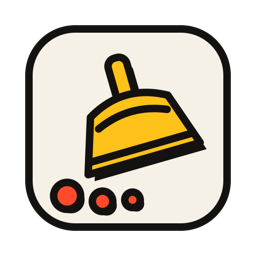
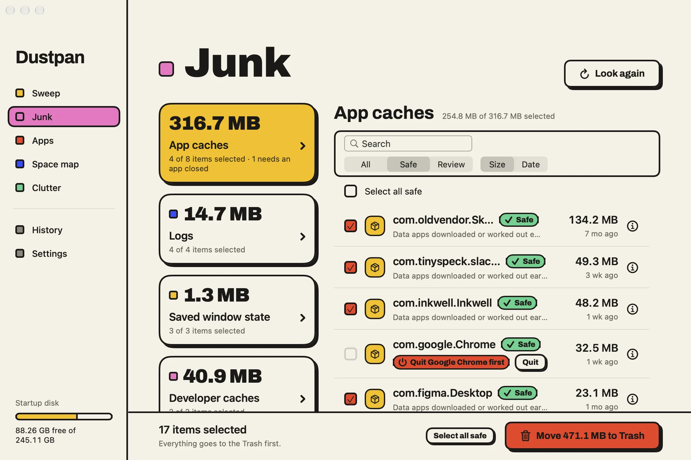

<p align="center">
  
</p>

<h1 align="center">Dustpan</h1>

<p align="center">
  <b>Clear the clutter. Keep the undo.</b><br>
  A free, native macOS disk cleaner that explains every item in plain words<br>
  and moves only what you approve to the Trash.
</p>

<p align="center">
  macOS 14+ · Apple Silicon and Intel · MIT License<br>
  <a href="https://craftbydan.github.io/dustpan/"><b>Website</b></a> · <a href="https://github.com/craftbydan/dustpan/releases/latest"><b>Download</b></a>
</p>

<p align="center">
  
</p>

## What it does

One click scans your Mac and groups what it finds into tiles you can open and read before anything moves.

| Section | What you get |
|---|---|
| **Sweep** | One scan of everything below, with a single "you can free" total. |
| **Junk** | Caches, logs, build files and old installers, each marked **Safe** or **Review**. |
| **Apps** | Remove an app together with the files it left behind, and see which apps have updates. |
| **Space map** | Find which folders are actually big, all the way down. |
| **Clutter** | Duplicate files (matched by a hash of their whole contents) and big files you haven't opened in a while. |
| **History** | Every move is logged. Put any item back where it came from. |

It knows developer tools: Xcode and its simulators, npm, Yarn, pnpm, Cargo, Go, Gradle, pip, CocoaPods, JetBrains and more. It never lists your local AI models (Ollama, LM Studio) as junk.

## How it stays safe

- **Trash first.** Dustpan moves files to the Trash and logs each move, so everything can be put back. The only permanent delete is *Empty Trash*, and that asks first and shows the size.
- **A rule for every item.** Dustpan scans only the places in its [rule book](Core/Rules/rules.json) (179 rules), and each rule says in plain words what the files are and what happens if they go.
- **Careful defaults.** Files changed in the last 7 days are never pre-selected, and nor are items marked *Review*.
- **Protected places.** It never touches system folders, iCloud Drive, Mail, Photos libraries, Keychains or app databases.
- **No tricks.** No "free RAM" button, no scare warnings, no claims that deleting caches makes your Mac faster. It deletes files to free space and says so.

## Privacy

Dustpan runs only on your Mac. No account, no analytics, no crash reports. It goes online only when you open the Updates tab in Apps, to ask whether newer versions of your apps exist. The details are in [docs/privacy.md](docs/privacy.md).

## Install

Dustpan isn't notarized (it's free and made without a paid Apple developer account), so macOS asks you to confirm the first launch:

1. Download the disk image from the [Releases page](https://github.com/craftbydan/dustpan/releases) and drag **Dustpan** into **Applications**.
2. Open Dustpan. When macOS says it can't check the app, close the message.
3. Open **System Settings → Privacy & Security**, scroll down and click **Open Anyway** next to Dustpan. You do this once.
4. When Dustpan asks, turn on **Full Disk Access** so it can see caches, Downloads and the Trash. It works without it but sees less, and tells you so.

To check the download, compare `shasum -a 256 Dustpan-*.dmg` with the checksum on the release.

## Build from source

You need Xcode 16 or later and [XcodeGen](https://github.com/yonaskolb/XcodeGen).

```bash
brew install xcodegen
```

```bash
make project
```

```bash
make run
```

| Command | What it does |
|---|---|
| `make project` | Generates `Dustpan.xcodeproj` from `project.yml` (and creates `Config.xcconfig` from the example). |
| `make build` / `make run` | Debug build, then opens it. |
| `make test` | Runs the test suite. Every scanner and the Cleaner run against fake home folders in a temp directory, never your real disk. |
| `make lint` | Checks formatting with `swift-format`. |
| `make install` | Release build copied to `/Applications`. |
| `make dmg` | Builds the drag-to-install disk image in `dist/` (needs `brew install create-dmg`). |
| `make site` | Updates `site/` (rules, licences, download link, size and checksum) for a new release. |
| `make pages` | Publishes the committed `site/` folder to GitHub Pages. |

Builds are ad-hoc signed, so macOS forgets Full Disk Access after each rebuild. Grant it again in System Settings.

### Project layout

```
App/            App entry, window, shared state
Features/       One folder per screen (View + Model)
Core/           Scanning, rules, cleaning, apps, duplicates, persistence
DesignSystem/   Colours, type, shared components
Tests/          Unit tests and fixture home folders
site/           Landing page
```

Built with Swift 6 and SwiftUI. Scans and cleaning run off the main thread in Swift actors, and history is stored in SQLite via GRDB.

## Contributing

Issues and pull requests are welcome. Before opening a PR, run `make lint` and `make test`. New cleaning rules need a plain-words explanation (140 characters or fewer) and a risk level. Anything that would delete files permanently, or touch the protected places above, won't be merged.

## Licence

Dustpan is released under the [MIT License](LICENSE). It is provided as is, without warranty: it moves files to the Trash so you can put them back, but keep a backup of anything you can't lose.

Dustpan uses open-source libraries and rule paths from other projects; their licences and credits are in [THIRD_PARTY_NOTICES.md](THIRD_PARTY_NOTICES.md) and [Core/Rules/RULES_ATTRIBUTION.md](Core/Rules/RULES_ATTRIBUTION.md).
